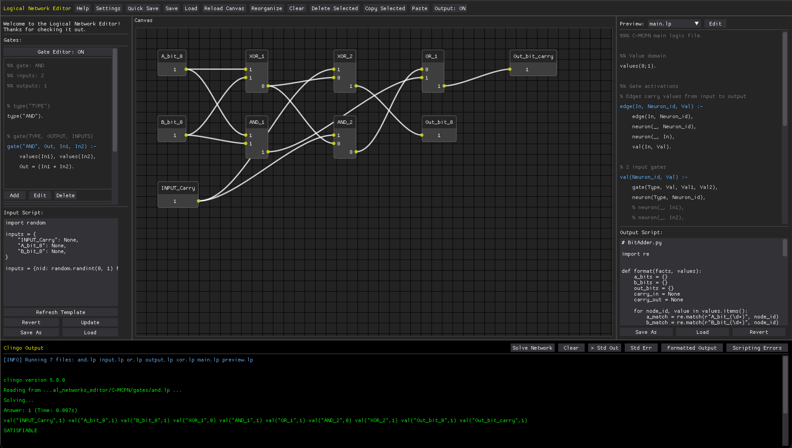

# C-MCPN: The Clingo McCulloch-Pitts Network Editor

The Clingo McCullough-Pitts Network Editor (C-MCPN) is an internally designed system for research into more efficient [artificial neural network](https://en.wikipedia.org/wiki/Neural_network_(machine_learning)) (ANN) representations, inference, and learning.

C-MCPN is designed to represent, and provide inference over, [McCullough-Pitts Networks](https://en.wikipedia.org/wiki/Artificial_neuron#McCulloch%E2%80%93Pitts_(MCP)_neuron) (MCPNs). MCPNs are an early form of ANNs, preceding advancements in ANN neurons and structures that paved the way for machine learning over ANNs.

At its core, C-MCPN uses advanced satisfiability technology to represent and provide inference over ANNs. In particular, our representations and associated "algorithms" for inference are written in the language of Clingo, an [Answer Set Programming language](https://en.wikipedia.org/wiki/Answer_set_programming) (ASP) from [Potassco Technologies](https://potassco.org/). These systems are designed for solving computationally difficult problems, in particular those in [NP-Complete](https://en.wikipedia.org/wiki/NP-completeness) and [NP-Hard](https://en.wikipedia.org/wiki/NP-hardness). By merging ANN and ASP technologies we hope to discover mechanisms with which we can accelerate the learning and inference processes to create more computationally efficient systems.

## Background
The rise of [large language models](https://en.wikipedia.org/wiki/Large_language_model) (LLM) and other [machine learning](https://en.wikipedia.org/wiki/Machine_learning) (ML) technologies has created an exciting and simultaneously disquieting atmosphere. Massive footprints in terms of physical real estate, water and power usage, heat generation, and other issues related to contemporary machine learning training and inference are simultaneously altering the public perception of computing, both in both positive and negative ways.

C-MCPN was produced by the *reserach group redacted* that seeks to create more efficient processes, in particular with respect to problems that require significant computational power. We hope to use existing technology from artificial intelligence, in particular satisfiability systems, to create a more sustainable computational landscape.

## Application Overview
C-MCPN is designed as a terminal-based utility, and is (optionally) enhanced with a graphical user interface (GUI) for user efficiency and convenience. The GUI allows for a drag-and-drop interface for rapid prototyping of ANN nodes and structures. As a domain to ground the software, we have included the ANN representations of a number of basic digital logic "gates", allowing for convenient experimentation in digital hardware as a built-in starting point for the user.



Built-in "gate" neurons can be dragged and dropped into the editor's main canvas, and connections can be made similarly by mouse click and drag. For more advanced functionality users can provide specifications for neurons outside of the provided set for more generalized use.

## Installation and Use

The install and run scripts are located in `logical_networks_editor/`.

### macOS / Linux

**Dependencies:**  [Python 3.12+](https://www.python.org/downloads/) [Clingo](https://potassco.org/clingo/)
* `apt install clingo` on Linux
* `brew install clingo` on Mac

```bash
bash install.sh
bash run.sh
```

### Windows

**Dependencies:** [Anaconda](https://www.anaconda.com/download) or [Miniconda](https://docs.conda.io/en/latest/miniconda.html), the [Windows Subsystem for Linux](https://learn.microsoft.com/en-us/windows/wsl/install)

```bat
install.bat
run.bat
```


### Terminal Overview

To run a network directly on the terminal, the files needed are located in `logical_networks_editor/C-MCPN/`:

```bash
clingo base/main.lp networks/[network].lp gates/[gate_1].lp ... gates/[gate_n].lp
```

Pipe the Clingo output into the interpreter provided for more readable output:

```bash
clingo base/main.lp ... | python3 tools/interpreter.py
```


<!--  -->

# Attributions
C-MCPN was developed in collaboration with the -redacted for publication- research group. For citation purposes, you can reference:

**redacted**
